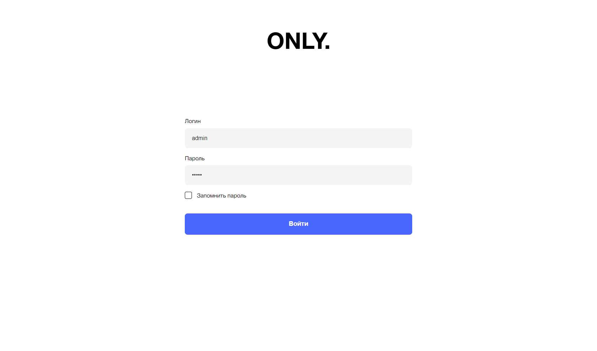
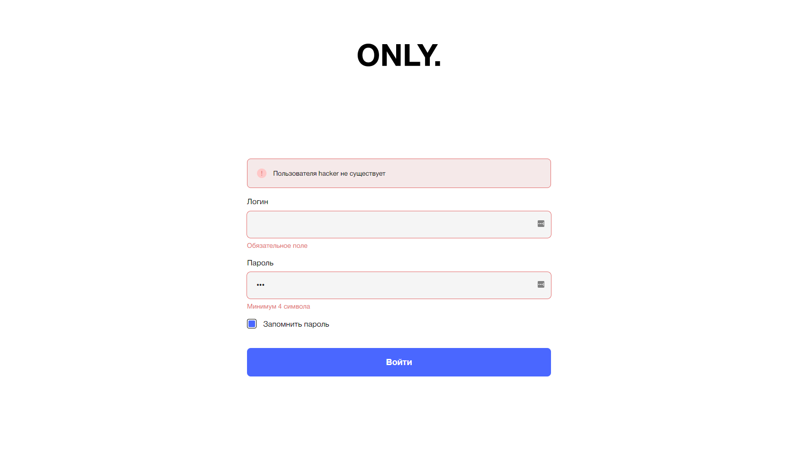

# Simple Login form with React Hook Form

## Features

- Input validation
- Auth services
- Remember me option
- Server error alert

## Screenshot

## Links

- Solution URL: https://github.com/FightM9/auth-form
- Live Site URL: https://auth-form-sigma.vercel.app

### Built with

- Semantic HTML5 markup
- CSS custom properties
- [Typescript](https://www.typescriptlang.org/) - Syntactical superset of JavaScript
- [React](https://reactjs.org/) – JS library
- [React Router v6](https://reactrouter.com/) – for page routing
- [Styled-component](https://styled-components.com/) - For styles
- [React Hook Form](https://react-hook-form.com/) - For form